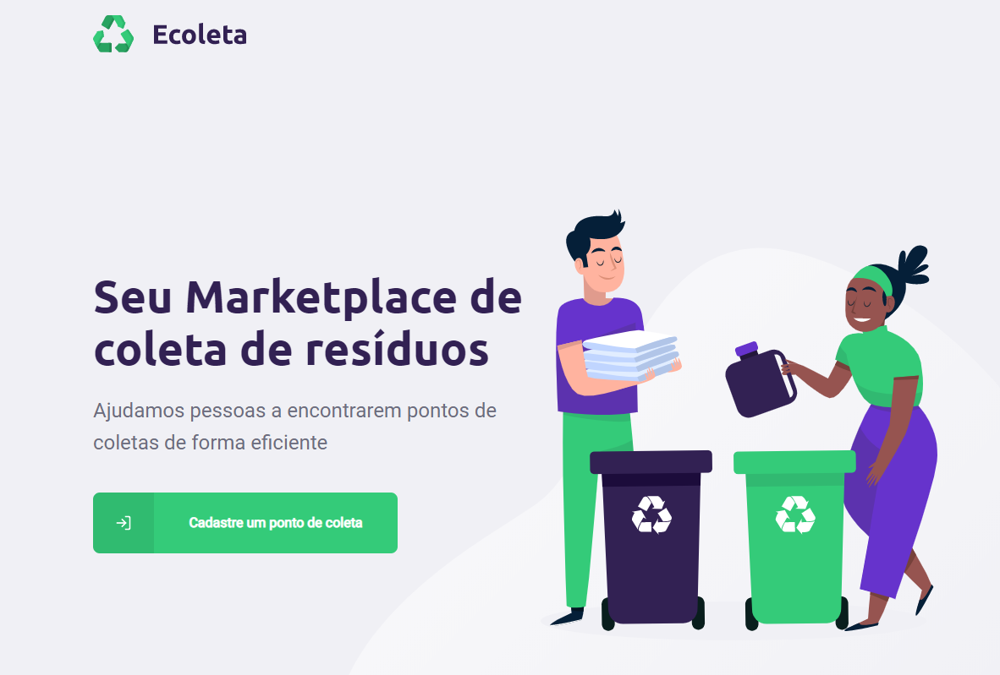
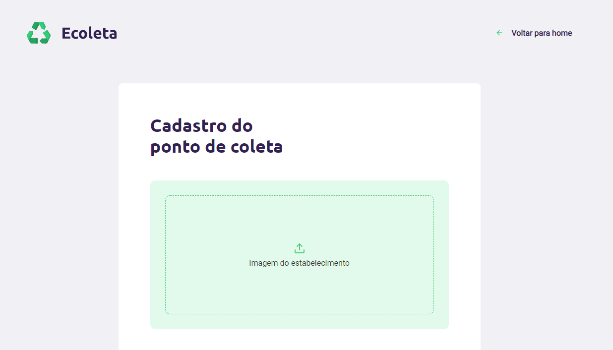
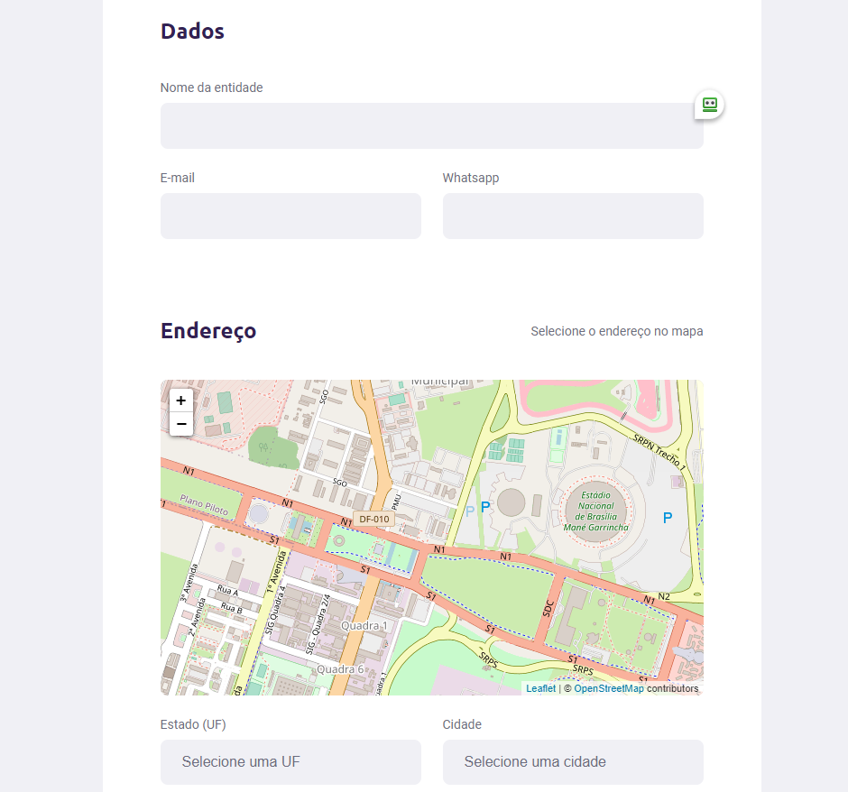

# E-coleta

Esta aplicação foi desenvolvida na Next Level Week #1 da Rocketseat.
Ela tem como objetivo oferecer ao usuário uma forma rápida de verificação de onde ele consegue encontrar pontos de coleta de lixo reciclável em sua cidade.
A aplicação conta com uma versão web desenvolvida com o uso de React, e seu app desenvolvido com React Native, já em seu backend é utilizado o NodeJS.

## Versão Web

